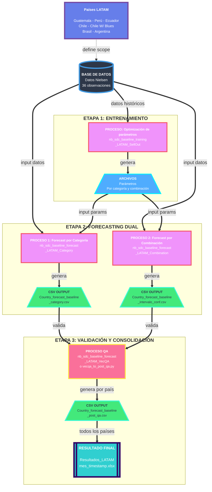

# Flujo de Información - Proceso de Forecasting LATAM

## Descripción General

Este diagrama muestra el flujo completo del proceso de forecasting para países de LATAM (Guatemala, Perú, Ecuador, Chile, Chile W/ Blues, Brasil, Argentina). El proceso consta de tres etapas principales:

1. **Entrenamiento**: Utiliza datos históricos de Nielsen para generar parámetros óptimos por categoría y combinación
2. **Forecasting**: Genera pronósticos tanto a nivel categoría como por combinaciones individuales
3. **Validación y Consolidación**: Valida y consolida los resultados en archivos finales por país y región

## Diagrama de Flujo

## Detalle de Etapas

### 1. Entrenamiento (Training)

- **Input**: Datos Nielsen (36 observaciones históricas por país)
- **Proceso**: `nb_sdc_baseline_training_LATAM_SellOut`
- **Output**: Archivos de parámetros óptimos almacenados en `data/Params/{Country}/`
  - Parámetros por categoría (KO/NOKO)
  - Parámetros por métrica (price_lc, volume_uc)

### 2. Forecasting

Se ejecutan dos procesos paralelos con los mismos inputs (Nielsen + Params):

#### 2.1. Forecast por Categoría

- **Proceso**: `nb_sdc_baseline_forecast_LATAM_Category`
- **Output**: `{Country}_forecast_baseline_category.csv`
- Genera pronósticos agregados a nivel de categoría

#### 2.2. Forecast por Combinación

- **Proceso**: `nb_sdc_baseline_forecast_LATAM_Combination`
- **Output**: `{Country}_forecast_baseline_intervalo_conf.csv`
- Genera pronósticos detallados por todas las combinaciones posibles
- Incluye intervalos de confianza

### 3. Validación y Consolidación

#### 3.1. Validación QA (por país)

- **Input**: Ambos archivos de forecast (categoría + combinación)
- **Proceso**: `nb_sdc_baseline_forecast_LATAM_VecQA` (notebook) o `scripts/vecqa_to_post_qa.py` (script CLI)
- **Output**: `{Country}_forecast_baseline_post_qa.csv`
- Valida y reconcilia los pronósticos de ambas metodologías
- El script CLI permite automatizar este proceso sin necesidad de ejecutar el notebook manualmente

#### 3.2. Consolidación Regional

- **Input**: Archivos post-QA de todos los países
- **Output**: `Resultados_LATAM_{mes}_{timestamp}.xlsx`
- Archivo final que consolida resultados de todos los países LATAM

## Archivos de Salida

### Por País (en `data/`)

- `{Country}_forecast_baseline_category.csv` - Pronóstico por categoría
- `{Country}_forecast_baseline_intervalo_conf.csv` - Pronóstico por combinación
- `{Country}_forecast_baseline_post_qa.csv` - Pronóstico validado final

### Consolidado Regional (en `target_model/`)

- `Resultados_LATAM_{mes}_{timestamp}.xlsx` - Resultados consolidados de todos los países
